<p align='left'>
  
</P>

<a id="top"></a>

## `Bloques temáticos:`

- [**Instalación react-router-dom**](#item1)
- [**Creando nuestras primeras páginas**](#item2)
- [**React-router-dom**](#item3)
- [**NavLink & Link**](#item4)
- [**Homework**](#item5)

---

---

# `Instalación react-router-dom`

<a id="item1"></a>

Para comenzar a trabajar lo que voy a precisar es hacer la instalación de `react-router-dom`, entonces, arranquemos desde aquí.

Voy a ir a mi terminal de visual studio code y agregaré el siguiente comando para instalar esta dependencia.

```
npm install react-router-dom
```

Este comando lo que hará es instalar la última versión de `react-router`. En este caso, si voy a mi `package.json`, la versión sería la siguiente:

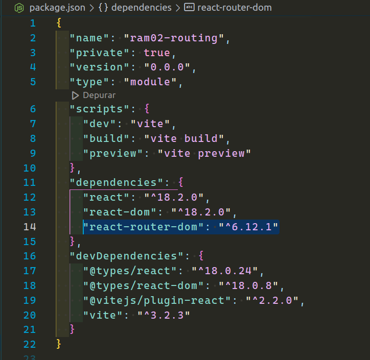

Para instalar esta misma versión puede ingresar el siguiente código:

```
npm install react-router-dom@6.12.1
```

Nosotros iremos haciendo las instalaciones de las últimas versiones en la trayectoria del curso, pero puede que alguien haga este tutorial más adelante y esto es algo que debe tener en cuenta.

---

---

# `Creando nuestras primeras páginas`

<a id="item2"></a>

Ya contando con la instalación de `react-router-dom`, ahora podemos avanzar creando algunas de nuestras páginas para posteriormente crear sus rutas.

Dentro del directorio `ram` que sería nuestra aplicación, ya habíamos creado un directorio `pages` que contenía nuestra `HomePage.jsx`, aquí es donde crearemos las páginas `EpisodesPage.jsx` y `LocationPage.jsx`.

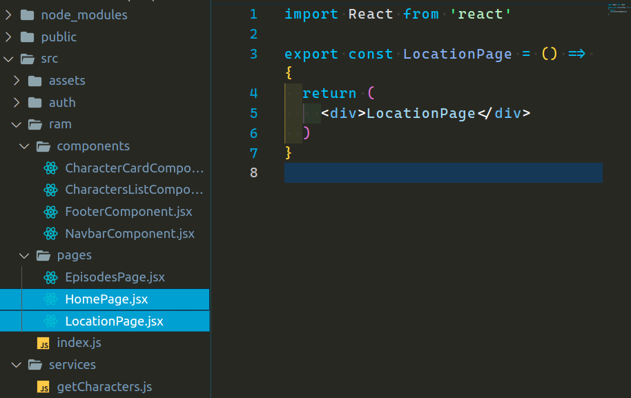

Por el momento dejaremos cada una de nuestras páginas con un `div` que contiene un título. Creo que ya saben mi paso a seguir acorde a mi forma de trabajar en el proyecto. Voy a añadir estas páginas a mi archivo de barril.

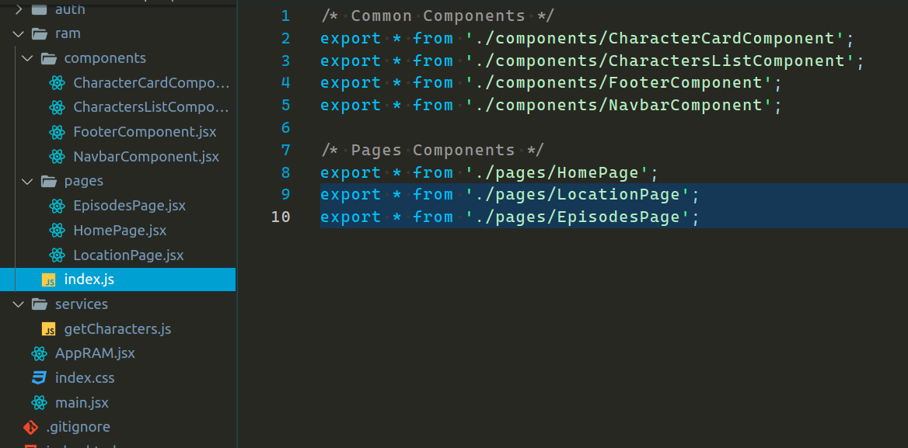

---

---

# `React-router-dom`

<a id="item3"></a>

Ya tenemos nuestras páginas, pero estas páginas no las vamos a inyectar como un componente, a estas debemos crear unas rutas para luego ver su contenido a través de `"URLs"`. Para hacer esto necesitaremos el enrutador que nos provee react y así combinarlas con nuestros componentes.

Voy a crear un nuevo directorio al mismo nivel que `auth` y `ram` llamado `router`. Aquí adentro crearé un nuevo archivo llamado `AppRouter.jsx`. Podría dejarlo con extensión `.js`, pero la verdad es que voy a utilizar jsx, así que preferí llamarlo así.

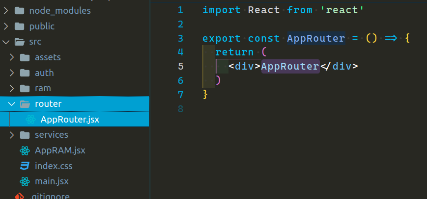

Ahora voy a proceder a modificar mi archivo `AppRAM.js` inyectado en el archivo raíz. Donde inyecto `HomePage.jsx` ahora voy a inyectar este nuevo componente que contendrá todas mis rutas en un futuro.

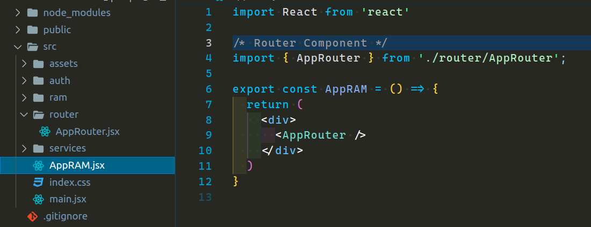

Aquí no tiene mucho sentido armar un archivo de barril ya que no voy a importar más de un enrutador en este proyecto, por ende, lo dejaré así como está.

**Estructura de React-router-dom**

Voy a precisar BrowserRouter, Route, Routes de `react-router-dom`, estos serán quienes armen mi estructura para poder navegar entre rutas.

- BrowserRouter: Conecta nuestra aplicación a la URL del navegador, es decir mantiene la interfaz de usuario en sincronía con la URL del navegador mediante la API History de HTML5

- Routes: Genera un árbol de rutas y a partir de este nos permite reemplazar la vista con el componente que coincide con la URL de nuestra barra de navegación y nos va a renderizar solamente dicho componente.

- Route: Representa una ruta en el árbol, necesita al menos las siguientes propiedades path y element, para representar una ruta.

Con esta información comenzaré a trabajar en nuestro `AppRouter.jsx`. Importo los tres desde `'react-router-dom'` y renombro a BrowserRouter a Router, simplemente para que sea más sencillo y corto. Pueden dejarlo como está si quieren.

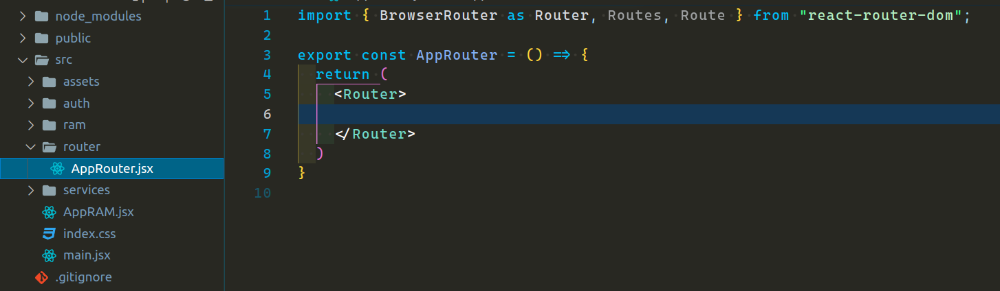

Va tomando algo de color, y como pueden ver, el router envolverá todas mis rutas, pero también podría envolver contenido que yo quiero que se muestren en todas estas rutas, como lo podría ser un navbar o footer. Veamos un ejemplo de eso.

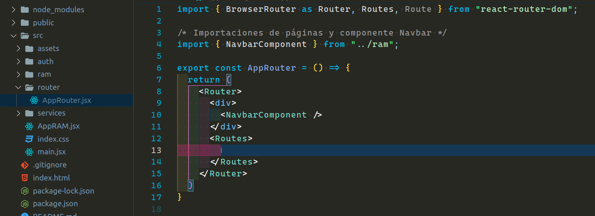

Aquí lo que estoy logrando es que el navbar sea renderizado en todas en el componente AppRouter, y luego por otro lados renderizaré la ruta según mi URL.

Agreguemos algunas rutas y veamos que sucede.

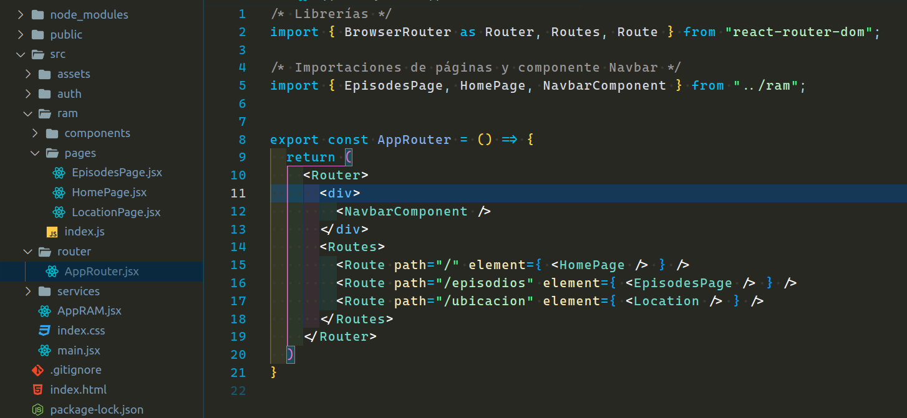

Resultado:

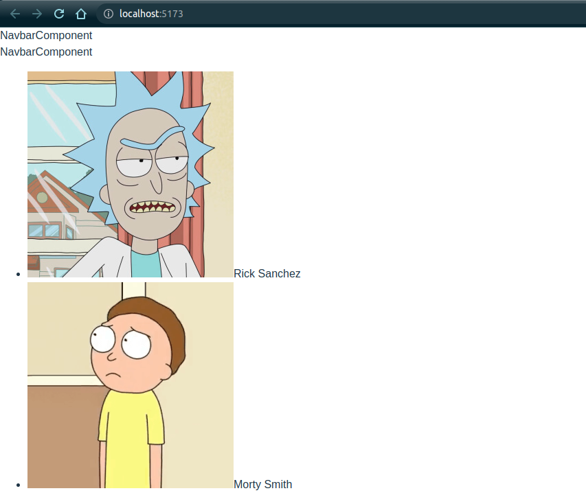

Ya esta funcionando, sin embargo, podemos ver que navbar aparece dos veces. Eso es porque se está renderizando la ruta `<HomePage>` por el path `"/"`, y este también tiene el navbar, así que ese ya no lo necesitaremos y podemos retirarlo.

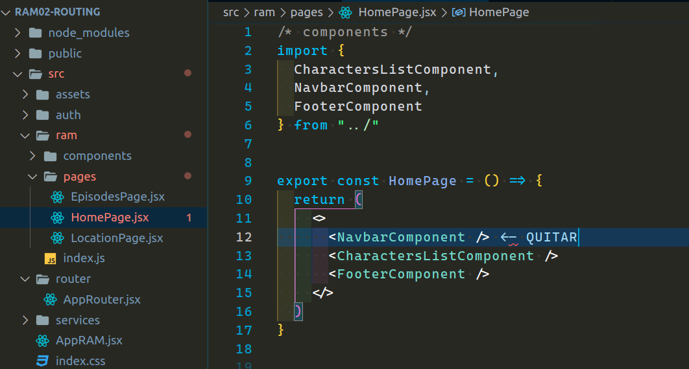

Ahora si. Si nosotros queremos, ya podríamos navegar entre rutas.

Ve al navegador y haz la prueba, agrega la siguiente URL:

```
http://localhost:5173/espisodios
```

Deberías ser capaz de ver lo siguiente:

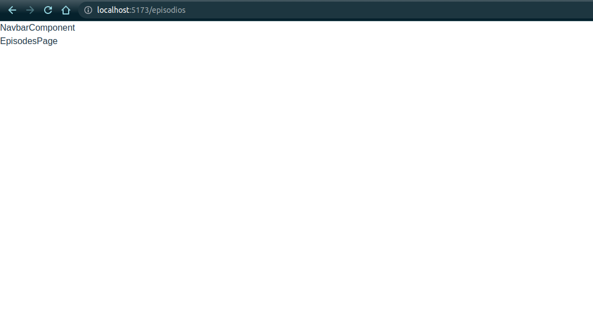

Lo mismo pasaría con `http://localhost:3000/ubicacion`.

---

---

# `Link`

<a id="item4"></a>

Ya funcionando nuestras rutas ahora podríamos crear enlaces que al hacer un clic nos lleve a una ruta específica.

Primero vamos a conocer un método que nos trae `react-router-dom`. Este es el método Link, el cuál se utiliza para crear enlaces a diferentes rutas dentro de una aplicación de React.

- Link: El componente link en React Router funciona a partir de su propiedad `to`. En esta propiedad, asignamos como valor el enlace a la página que queremos llevar. Por debajo de link hay un elemento a. Sin embargo, React browser Router lo envuelve de una manera en la que no se fuerce la petición al servidor. Por ello, el componente link nos permite mantener la navegación a nivel del browser o navegador.

Veamos un ejemplo de cómo podríamos realizar enlaces a nuestras rutas ya implementadas desde el componente `NavbarComponent`:

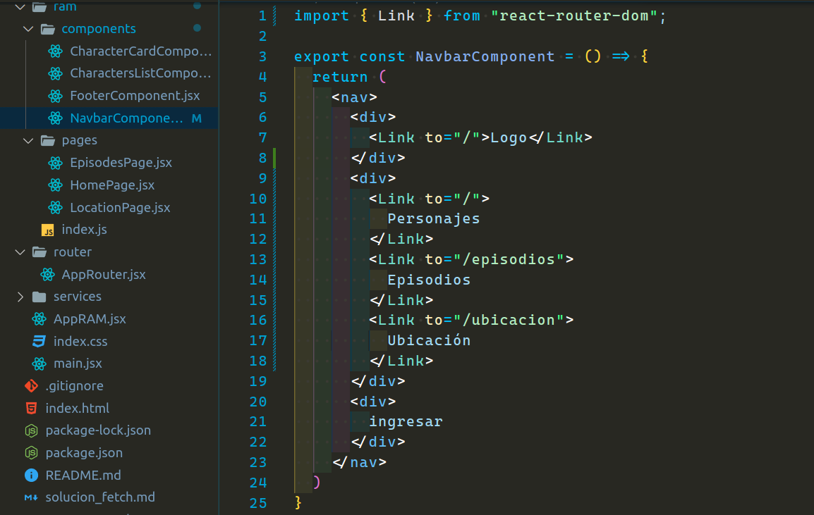

Podemos ver que el llamamos al componente `Link` 4 veces.

Primer llamado del componente Link de react-router-dom:

```jsx
<div>
  <Link to="/">Logo</Link>
</div>
```

En este fragmento de código, se crea un div que contiene un enlace (Link) con el texto "Logo". El atributo to="/" indica que el enlace dirige a la ruta principal de la aplicación.

Resto de los componentes link:

```jsx
<div>
  <Link to="/">Personajes</Link>
  <Link to="/episodios">Episodios</Link>
  <Link to="/ubicacion">Ubicación</Link>
</div>
```

Aquí se crean tres enlaces más utilizando el componente Link. Cada enlace tiene un texto que representa una sección específica de la aplicación y un atributo to que indica la ruta a la que se dirige cada enlace.

También dependiendo la estructura de estilos podría encerrar cada enlace en un `div` contendedor, por ejemplo, si desean aplicar estilos específicos a cada enlace o envolverlos en una estructura de cuadrícula.

Ej:

```jsx
<div>
  <div>
    <Link to="/">Personajes</Link>
  </div>
  <div>
    <Link to="/episodios">Episodios</Link>
  </div>
  <div>
    <Link to="/ubicacion">Ubicación</Link>
  </div>
</div>
```

Yo por el momento lo dejaré como el primer ejemplo. Lo que si me gustaría añadir es resaltar visualmente el enlace activo en la barra de navegación, es decir, que al hacer un clic en uno de estos enlaces se le de ciertos estilos al mismo para resaltar como "enlace activo", agregando una clase de css que voy a llamar `active`.

Antes de la versión 6 de react-router-dom se utilizaba un componente llamado `NavLink`, sin embargo, a partir de la v6+ el componente NavLink ha sido eliminado y no está disponible. En su lugar, podemos utilizar el componente Link como lo tenemos y agregar lógica para resaltar el enlace activo utilizando el enrutador `useLocation` proporcionado por react-router-dom.

Cambiemos el código para ver cómo lograrlo:

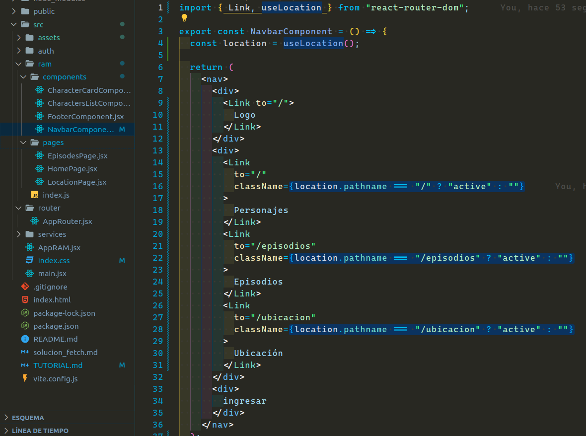

En este ejemplo, utilizamos el hook useLocation de react-router-dom para obtener la ubicación actual. Comparamos `location.pathname` con la ruta de cada enlace y, si coinciden, agregamos la clase "active" al enlace mediante la propiedad className.

Voy a agregar la clase `active` en el archivo `index.css` para comprobar que el código anterior esté funcionando:

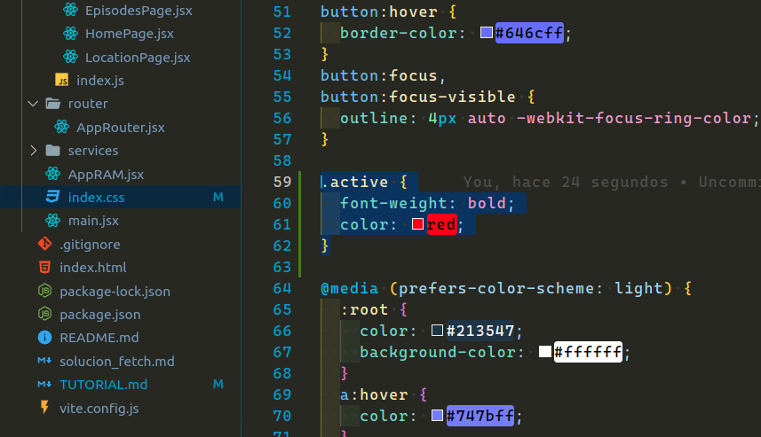

Resultado:

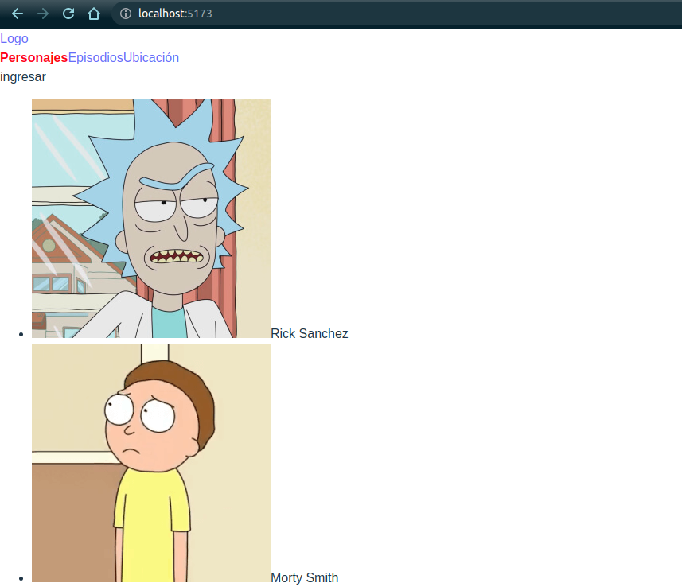

Definitivamente el código está funcionando. La aplicación no se ve muy bonita hasta ahora, pero ya iremos mejorando la misma con las próximas unidades.

---

---

# `Homework`

<a id="item5"></a>

Para hacer la tarea, primero voy a mostrar algo que está pasando con la navegación de nuestra rutas.
Podemos ver que funciona correctamente cuando se hace clic en un componente, pero que pasa si alguien recibe un link de nuestra app, pero este link no es correcto ya que no está en nuestro enrutador, por ejemplo:

```
http://localhost:5173/perritofeliz
```

Veamos eso:

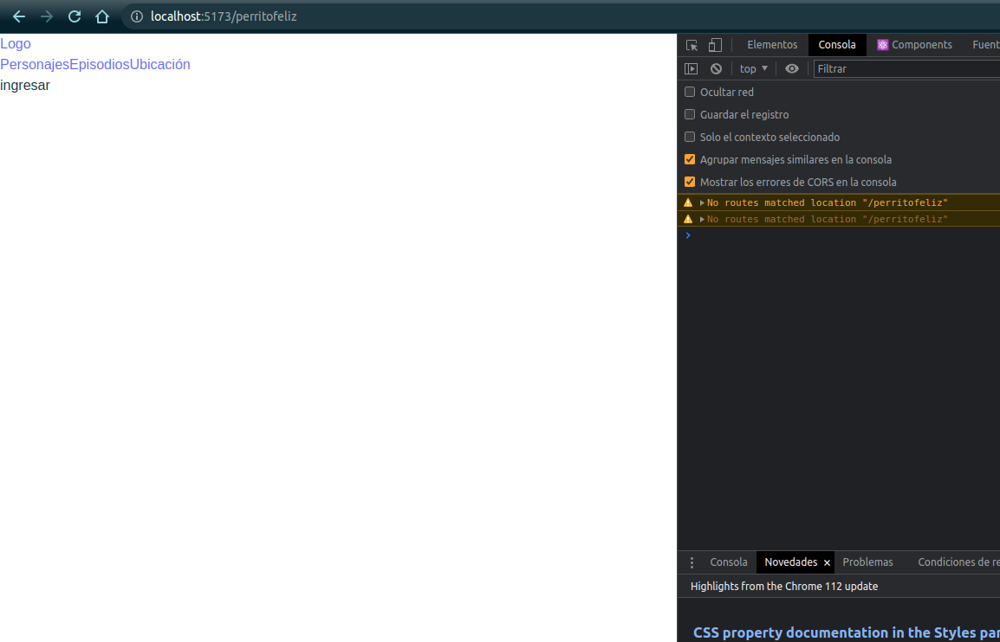

Podemos ver que nuestro enrutador no hace match con ninguna de nuestras rutas, por ende, nosotros podríamos crear una nueva página para manejar estos casos, y en caso de que nos llegue una URL que no haga match, mostrar un error, por ejemplo un 404 not found.

1 - Crear una nueva página y nombrarla `NotFoundPage.jsx` dentro de nuestro directorio `pages`. El contenido de este componente debe dar información al usuario que la página no ha sido encontrada. Ej: Error 404, página no encontrada.

2 - Añadir la página al archivo de barril.

3 - Crear una nueva ruta, el path será `path="/*"` y el elemento debe ser nuestra página recién creada. Lo que indicamos con /\* es que si una página no hace match con ninguna de nuestras rutas, va a hacer match con esta.

4 - Crear en el directorio `auth` el directorio `pages` y añadir dentro dos páginas, una para login y otra para registro.

5 - crear dentro de `auth` el archivo de barril y exportar estas páginas.

6 - crear rutas para login y registros, los path son a elección.

7 - En nuestro `NavbarComponent`, hay un div que contiene el texto "ingresar", en este vamos a implementar un `Link` similar al del logo, solo que este va a dirigir a mi ruta del componente `Login`, o sea, al path que optaron para el mismo.

Nos vemos con la solución la semana que viene.
