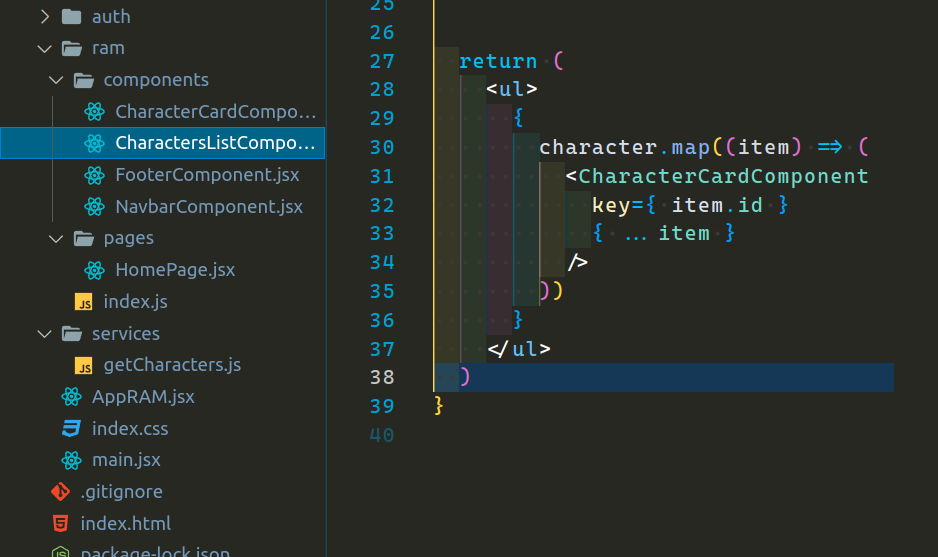

<p align='left'>
  
</P>

<a id="top"></a>

## `Bloques temáticos:`

- [**Función fetch**](#item1)
- [**hooks: useState & useEffect**](#item2)
- [**Componetización: CharacterCard.jsx**](#item3)
- [**Archivo de barril**](#item4)
- [**Props de componente**](#item5)
- [**desafío extra: loading**](#item6)

---

---

# `Solución homework`

---

<a id="item1"></a>

En primer lugar se pedía crear un nuevo directorio `services` dentro de `src`. Dentro de "services" voy a implementar nuestra función que se encargará de hacer el llamado a la Api para obtener toda la información de los personajes de Rick & Morty. Yo lo voy a llamar `getCharacters`.


He creado y a la vez exportado una función que retorna una promesa de nuestra Api.

El método `.then()` se utiliza para adjuntar una función de devolución de llamada que se ejecutará cuando la promesa se resuelva. La función de devolución de llamada se ejecutará pasándole el resultado de la promesa (la respuesta de la API) como argumento.

Dentro de la función de devolución de llamada adjunta a `.then()`, se utiliza el método `.json()` en el resultado de la promesa para extraer el cuerpo de la respuesta de la API como un objeto JSON. Este método convierte la respuesta en formato JSON en un objeto JavaScript, lo que te permite acceder a los datos de manera más sencilla.

---

---

## `hooks: useState & useEffect`

<a id="item2"></a>

El segundo paso era crear nuestros hooks en el archivo `CharactersListComponent.jsx`. Comencemos por el useState que se encargará de manejar nuestro estado, el cual iniciaremos como un arreglo vacío, este hook se va encargar de almacenar toda la información que me llegará de mi Api.


En el ejemplo ya borré el arreglo temporal. Asegurense de importar `useState()` de React.

Ahora proseguimos con nuestro useEffect. Recuerden que este se encargará de hacer nuestro primer renderizado, aquí es donde vamos a pasarle nuestra función creada `getCharacters`, la cual tenía una promesa. Asegurense de importar la función que implementamos, además del hook useEffect que nos provee React. <br>
El `.then()` recibía una función, la cual le pasamos por parámetro la data que nos iba a llegar.


Yo lo primero que hice fue hacer un `console.log(data)`, para asegurarme que funcione y además de ver cómo me está llegando la data y cómo debería manejar la misma. Ya comprobando que funciona, esta información se la pase la función de mi useState. Agregue un `.catch()`, que por el momento, en caso de haber un error retornaré un console.log() del mismo.

Ya con esto, nuestra App debería estar funcionando, de igual manera, aun queda el tercer punto que va a ser componetizar nuestro `<li>` dentro del map.

[**subir**](#top)

---

---

<a id="item3"></a>

## `Componetización: CharacterCardComponent.jsx`

En mi carpeta components creo este nuevo componente llamado `CharacterCardComponent.jsx` y le paso el siguiente código:


Es un componente simple que retornará un código jsx estructurado por un `<li>` como padre, dentro del mismo tengo una etiqueta `img`y un `span` que contiene el nombre del personaje. Tanto img como el name me van a llegar por props, en este caso yo hice una desestructuración de las props.

Si alguien necesita refrescar la memoria con desestructuración dejo la documentación:
<https://developer.mozilla.org/es/docs/Web/JavaScript/Reference/Operators/Destructuring_assignment>

[**subir**](#top)

---

---

<a id="item4"></a>

## `Archivo de barril (opcional)`

Como opcional se podía exportar el componente anterior desde el archivo de barril:


A la hora de importar este nuevo componente en `CharacterListComponent.jsx`, solo hay que tener cuidado ya que tanto el componente `CharacterListComponent` y `CharacterCardComponent` estan en el mismo nivel, por ende, el path de nuestra importación debe subir un nivel más, simplemente con agregar un punto es suficiente.
Ej: `"../"` en vez de `"./"`.

Así quedan nuestras importaciones hasta el momento:


[**subir**](#top)

---

---

<a id="item5"></a>

## `Props de componente`

En nuestro componente `CharactersListComponent.jsx` voy a inyectar este componente `CharacterCardComponent` en lugar del `li`. Debo pasarle las props que me pide, estas eran el name e image. Además voy añadir una llave `key` como identificador único.


La propiedad `key` en React se utiliza para asignar un identificador único a cada elemento en una lista renderizada. Esta propiedad es requerida por React cuando se renderizan listas para ayudar a identificar y rastrear los elementos de manera eficiente durante las actualizaciones. Hay casos donde probablemente vean que se le pasa el index del array como en el siguiente ejemplo:

```jsx
function MyComponent() {
  const items = ["Item 1", "Item 2", "Item 3"];

  return (
    <ul>
      {items.map((item, index) => (
        <li key={index}>{item}</li>
      ))}
    </ul>
  );
}
```

La propiedad key se establece en index, que es el índice del elemento en el array. Si los elementos del array se mantienen estáticos y no se agregan ni se eliminan con frecuencia, esta forma de utilizar key podría ser aceptable. Sin embargo, si los elementos de la lista pueden cambiar con frecuencia, se recomienda utilizar identificadores únicos en lugar de índices para evitar problemas de rendimiento y errores en las actualizaciones.

`Props de componente con desestructuración`

También podríamos hacer una desestructuración para seleccionar las props que necesitemos.


A mi gusto, esta forma se ve mucho más prolija y legible.

¿Pero qué pasaría si necesito pasar un listado mucho más grande de props?
Se volvería algo tedioso, pero por suerte existe otra forma que solventa este problema y es la siguiente:



Bueno, este código no es difícil de entender. En primer lugar `item` ya sabemos que es el elemento de cada iteración. Lo que debemos tener en cuenta es que por cada iteración a mi me va a llegar un objeto, por ende, en las propiedades de mi componente podría pasarle entre llaves el operador spread para propagar toda esta data de dicho elemento, de esta forma voy a pasar absolutamente toda la información del objeto que me está llegando a mi componente `CharacterCardComponent`, luego en este componente podría desestructurar y utilizar lo que a mi me interese mostrar en este mismo.

[**subir**](#top)

---

---

<a id="item6"></a>

## `desafío extra: loading`

Ya con esto hemos terminado. Había un plus de loading, que ese lo hacemos rápido. Creamos un hook más el cual lo iniciaremos con un booleano en true. Agregamos a nuestro useEffect el `.finally()`, luego de nuestro `catch()`, A este le pasamos una función que invoque la función de mi hook useState `setLoading()` para setear el valor en false.

Abajo lo que quedaría agregar es una condición de que si loading está en true vamos a retornar un div con un texto que diga "Cargando...", por ejemplo. Esto ya lo mejoraremos con un spinner a futuro.


Listo, con esto hemos terminado el code review de nuestro desafío. El extracredit lo dejaré para el tutorial de esta unidad.

Los invito a intentar completar el siguiente desafío en el `"TUTORIAL.md"`.

[**subir al índice**](#top)
